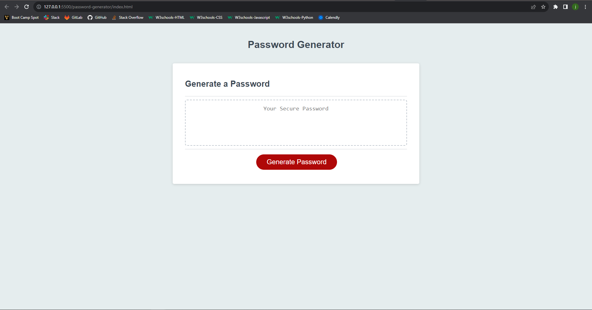

# password-generator
I want to create a webpage to generate a password using JavaScript, CSS, and HTML.

## Description

 - I wanted challenge myself to create a password randomizer.

## Table of Contents

  - [Credits](#credits)
  - [Badges](#badges)
  - [Features](#features)
  - [Questions](#questions)
  - [Screenshot](#screenshot)
  - [DeployedApp](#deployedApp)

## Credits

 - This website was coded by Joseph Dakota Johnson.

 - Tutor Alexis Gonzalez helped me during class by teaching me ways I can get my if else statement and for loop working.

 - My brother (boot camp graduate) helped out by helping me figure out how to log in to the assignment, update the repo, code the syntax of CSS variables, and turn it in. [Dylan's GitHub account](https://github.com/dylanstormjohnson)

## Badges

 - 
 - 

## Features

 - When the user clicks the generate password button, there is a prompt
    that asks the user the length of the password.
 - Next, there is a prompt that asks the user if there will be any lowercase,
    uppercase, numeric, or special characters in the password.
 - If the user inputs and invalid length or no characters, the user is
    given an error response and the application is discontinued.
 - A password is generated meeting the requirements set by the user.
 - I added notes stating what the different parts of the code in JavaScript
    do.

## Questions

 - If you have any questions for me, my GitHub account is [Dakota's GitHub account](https://github.com/josephdakotajohnson)
 
## Screenshot

 - This is a screenshot of the application: .
 
## DeployedApp

 - This is a link to the fully deployed application: (https://github.com/josephdakotajohnson).